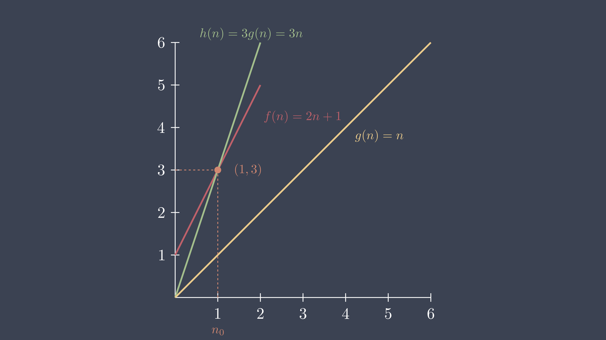
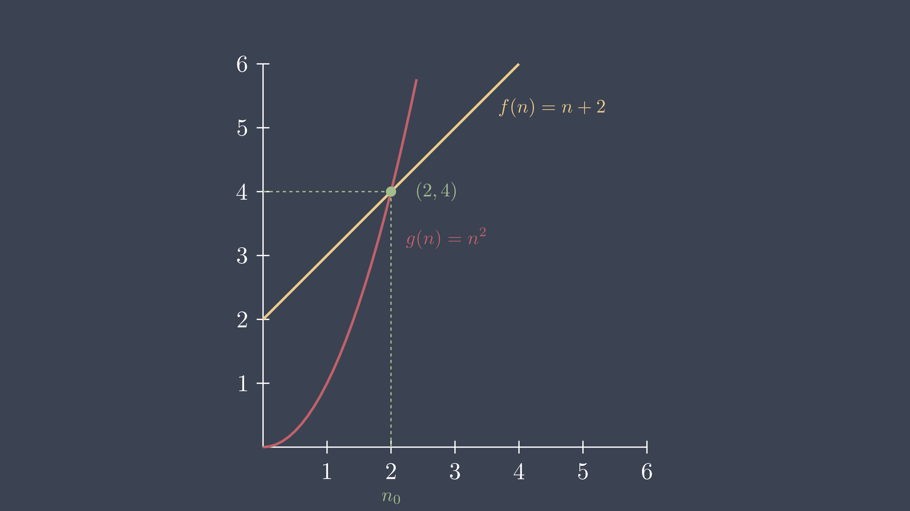
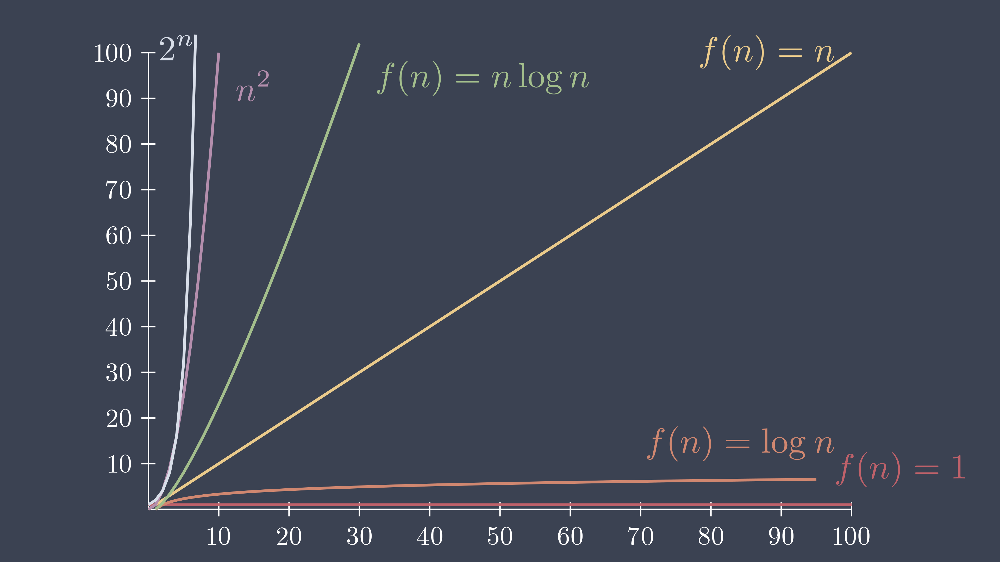

# What is an Algorithm?
## Introduction
恭喜你，你踏入了演算法的大門。

如果你有看過一些演算法的書或者是一些網站，你可能會發現演算法的定義有點抽象。但就我的理解，就是這四點:

1. 演算法由*有限*的指令組成
2. 演算法是為了解決特定問題
3. 演算法是一步一步執行的
4. 演算法含有輸入與輸出

這樣就好了，並不用對定義太過於嚴格，會寫更重要，**演算法就是一個解決問題的方法**。

你可能有聽過流程圖，這是一個很好用來視覺化演算法的工具，例如之前在 [Repetiton Structures - While loop](../fundamental/python/repetition_structures.md#while_loop) 有提到的 [Collatz Conjecture](https://en.wikipedia.org/wiki/Collatz_conjecture)，我們可以用流程圖來表示:

$$
f(n)=\begin{cases}\frac{n}{2}, & \text{if } n \text{ is even} \\ 3n+1, & \text{if } n \text{ is odd}\end{cases}
$$

``` mermaid
graph LR
A[Input a number N] --> B{Is N == 1?};
B -- Yes --> C[End];
B -- No --> D{Is N odd?};
D -- Yes --> E[N = 3N + 1];
D -- No --> F[N = N // 2];
E --> B;
F --> B;
```

## Complexity
在之前的章節中，我們遇到了一些有多種解法的問題，那我們要如何評估這些演算法的好壞呢?以及要以什麼標準(criteria)或基準(bechmark)來評估呢?

很直觀的，我們會想到以程式的執行時間來評估，但這樣的方法有一個問題，就是程式的執行時間會受到很多因素的影響，例如: 硬體、作業系統、程式語言、編譯器、輸入資料等等。所以我們需要一個更穩定的方法來評估演算法的好壞。

或許我們在 C++ 上寫了一個糟糕的演算法，而在 Python 上寫了一個「好的」演算法，但後者的執行時間卻比前者長，雖然你 Python 寫的速度比 C++ 快(XD)

我們不妨以演算法的步驟數來評估，並且觀察輸入資料與步驟數的關係。

舉以下的程式做為例子，定義一個函式 `print_hello`，並接受一個參數 `n`，印出 `hello, Algorithm!` 若干次。

``` python linenums='1'
def print_hello(n):
    for i in range(n):
        for j in range(n):
            print('hello, Algorithm!')

    for i in range(2 * n):
        print('hello, Algorithm!')

    print('hello, Algorithm!')
    print('hello, Algorithm!')
    print('hello, Algorithm!')


print_hello(2)
```

``` title="Output" linenums='1'
hello, Algorithm!
hello, Algorithm!
hello, Algorithm!
hello, Algorithm!
hello, Algorithm!
hello, Algorithm!
hello, Algorithm!
hello, Algorithm!
hello, Algorithm!
hello, Algorithm!
hello, Algorithm!
```

定義 $f(n)=n^{2}+2n+3$ 來代表輸入 $n$，會印出 `hello, Algorithm!` 的次數之間的關係。

而 $f(2)=11$，也就是說當 $n=2$ 時，我們的演算法會印出 `hello, Algorithm!` $11$ 次。

稱 $f(n)$ 為這個演算法的**時間複雜度(Time Complexity)**，而既然有時間複雜度，那當然也有**空間複雜度(Space Complexity)**，這是指演算法執行時所需要的記憶體空間，例如: 陣列的大小、變數的數量等等。

再舉一個例子，反轉一個串列，提供了兩種解法:

``` python linenums='1'
def reverse_list(lst):
    reversed_lst = []
    for i in range(len(lst) - 1, -1, -1):
        reversed_lst.append(lst[i])

    return reversed_lst


def reverse_list2(lst):
    n = len(lst)
    for i in range(n // 2):
        tmp = lst[i]
        lst[i] = lst[n - i - 1]
        lst[n - i - 1] = tmp
    return lst


print(reverse_list([1, 2, 3, 4, 5]))
print(reverse_list2([1, 2, 3, 4, 5]))
```

``` title="Output" linenums='1'
[5, 4, 3, 2, 1]
[5, 4, 3, 2, 1]
```

定義 $g(n)$ 來代表輸入 $n$，演算法所需要的額外空間(或說是輔助空間)，例如 $g(n)=n$，也就是說當 $n=5$ 時，我們的演算法會需要額外的 $5$ 個空間，或者說是需要大小為 $5$ 的串列。

試著比較上述兩個反轉串列的演算法:

| Algorithm      | $f(n)$ | $g(n)$       |
| -------------- | :-------| -------------:|
| `reverse_list` |   $n$  | $n$          |     
| `reverse_list2`|   $n/2$ | $1$  | 

`reverse_list` 會建立一個大小為 $n$ 的串列，儲存反轉後的串列，因此 $f(n)$ 與 $g(n)$ 都是 $n$，

而 `reverse_list2` 則是直接在*原地(in-place)*進行反轉，只使用 `tmp` 這個變數，所以 $g(n)$ 是 $1$，又因為只需要反轉一半的串列，所以 $f(n)$ 是 $\frac{n}{2}$。

這樣的比較方式，可以幫助我們選擇適合的演算法，並且評估演算法的好壞，但是這樣還稍嫌麻煩，有沒有更清楚且簡單的方法呢?

為接下來的內容先打個預防針，因為數學符號有點多，如果真的看不懂，可以直接跳到 [Calculating Big O](#calculating_big_o)，但還是請你試著多看幾次，我相信你可以。

## Big O Notation
### Definition
這時候就要介紹**大 O 符號(Big O Notation)**了，它是**漸近符號(Asymptotic Notation)**的一種，用來描述一個演算法在「最壞情況」下的時間複雜度，所以說它是一種*上界(Upper Bound)*，也通常指輸入資料的規模趨近無窮大時的行為，也就是 $n$ 很大的時候。

例如: 當 $n \to \infty$，$f(n)=n^{2}+2n+3$ 的行為就是 $\mathcal{O}(n^{2})$，因為當 $n$ 很大的時候，$n^{2}$ 會遠遠大於 $2n+3$，所以可以忽略掉 $2n+3$。

我們來看較為正式的定義:

!!! quote "Big O"
    $$f(n) \text{ and } g(n) \text{ are two functions.}$$

    $$\text{The function }f(n)=\mathcal{O}(g(n)) \text{ iff } \exists c,n_0 \text{ s.t } 0\le f(n) \le c*g(n),\forall n \ge n_0$$


先別急著關掉啦，先用中文解釋一下:

$f(n)$ 和 $g(n)$ 是兩個函數，若且唯若**存在常數 $c$ 和 $n_0$**，對於所有*大於等於* $n_0$ 的 $n$，使得 $f(n)$ *小於等於* $c*g(n)$，那麼 $f(n)$ 就屬於 $\mathcal{O}(g(n))$。

[MOB CHOIR - Exist](https://www.youtube.com/watch?v=UvnI1Sk5w2w)

其中 $\mathcal{O}(g(n))$ 是一個*函數集合*，它包含了所有以 $c*g(n)$ 為上界的函數，而 $f(n)=\mathcal{O}(g(n))$ 與 $f(n) \in \mathcal{O}(g(n))$ 都是代表 $f(n)$ 屬於 $\mathcal{O}(g(n))$ 的一員，看你習慣用哪一種符號。

還是不太懂，那我用更白話的方式還有我們熟悉的 $f(x)$ 來解釋:

有兩個函數 $f(x)$ 和 $g(x)$ 在二維的座標平面上，我如果找的到**一個倍數 $c$ 和一條鉛直線 $x=n_0$**，使得 $f(x)$ *在鉛直線右方($x \ge n_0$)*，$f(x)$ 的圖形都在 $c*g(x)$ 的*下方*，那麼 $f(x)$ 就屬於 $\mathcal{O}(g(x))$。

注意看強調的文字喔，白話的解釋應該能讓你在腦海中有畫面。

但覺得這樣還不夠清楚，我們直接來看例子，我相信你能看懂!

定義 $f(n)=2n+1, \ g(n)=n$，以及 $c=3, \ h(n)=c*g(n)=3n$，來看 $f(n)$ 是否屬於 $\mathcal{O}(g(n))$，請看下圖:



$h(n)$ 與 $f(n)$ 交於 $(1,3)$，那麼 $n_0=1$，且當 $n \ge n_0$ 時，$f(n)$ 會小於等於 $h(n)$，根據定義，我們找的到 $c$ 和 $n_0$，所以 $f(n)=\mathcal{O}(g(n))=\mathcal{O}(n)$。

再舉一個例子，定義 $f(n)=n+2,\ g(n)=n^{2},\ c=1,g(n)=cg(n)$，直接看圖:



$g(n)$ 與 $f(n)$ 交於 $(2,4)$，那麼 $n_0=2$，且當 $n \ge n_0$ 時，$f(n)$ 會小於等於 $c*g(n)$，根據定義，我們找的到 $c$ 和 $n_0$，所以 $f(n)=\mathcal{O}(g(n))=\mathcal{O}(n^{2})$。

在這個例子中，$n+2=\mathcal{O}(n^2)$，但你可以從第一個例子中類推出 $n+2=\mathcal{O}(n)$，根據定義，前者也是對的，但我們應該選擇更接近的上界 $\mathcal{O}(n)$ ，因為更能表現 $n+2$ 的行為，當然，$n+2=O(n\log_{}n)=O(n^2)=O(n^3)=O(n!)\cdots$ 也都是對的。

### Calculating Big O
那麼如何計算一個函數的大 $\mathcal{O}$ 符號呢?只要記住以下原則:

1. 忽略常數與係數，例如: $f(n)=114514$，那麼 $f(n)=\mathcal{O}(1)$，比較特別的是因為輸入資料的規模不會影響 $f(n)$ 的值，$\mathcal{O}(1)$ 又稱為*常數時間*。
2. 只保留最高次項，例如: $f(n)=n^2+2n+3$，那麼 $f(n)=\mathcal{O}(n^2)$。
3. 不在乎對數的底數，例如: $f(n)=n\log_{2}n$，那麼 $f(n)=\mathcal{O}(n\log_{}n)$。

### Common Big O
以下是一些常見的大 $\mathcal{O}$ 符號:

1. $\mathcal{O}(1)$: 常數時間，例如: 存取陣列的元素、交換兩個變數(Swap)
2. $\mathcal{O}(\log_{}n)$: 對數時間，例如: *二元搜尋法(Binary Search)*
3. $\mathcal{O}(n)$: 線性時間，例如: *摩爾投票算法(Boyer–Moore majority vote algorithm)*
4. $\mathcal{O}(n\log_{}n)$: 線性對數時間，例如: *快速排序(Quick Sort)*
5. $\mathcal{O}(n^2)$: 平方時間，例如: *泡沫排序(Bubble Sort)*
6. $\mathcal{O}(n^3)$: 立方時間，例如: 矩陣乘法
7. $\mathcal{O}(2^n)$: 指數時間，例如: *遞迴費氏數列(Fibonacci Sequence)*
8. $\mathcal{O}(n!)$: 階乘時間，例如: *旅行推銷員問題(Travelling Salesman Problem)*



這個參考就好喔，看過去就好，不用背，但應該可以讓你體會糟糕的演算法會有多恐怖，你可能會寫出直到宇宙終結都還在跑的程式(XD)。

## Other Notations
除了大 $\mathcal{O}$ 符號外，還有其他的漸近符號:

1. Big Omega: $\Omega(g(n))$，用來描述一個演算法在「最佳情況」下的時間複雜度，也就是*下界(Lower Bound)*。
2. Big Theta: $\Theta(g(n))$，用來描述一個演算法在「平均情況」下的時間複雜度，也就是*上界(Upper Bound)*和*下界(Lower Bound)*的交集。

但大 $\mathcal{O}$ 符號就夠用了，這兩個符號不用太過於深究。

來個總結吧:

$$\text{if } f(n)=3n+2 \text{ then:}$$

$$\underbrace{1 \lt \log_{}n \lt \sqrt{n} \lt n^{\frac{2}{3}}}_\text{lower bound, including Ω(n)} \lt \overbrace{n}^\text{Average bound, Θ(n)} \lt  \underbrace{n\log_{}n \lt n^2 \lt n^3 \lt \cdots \lt 2^n \lt \cdots \lt n^n}_\text{upper bound, including O(n)}$$

一樣，看看就好，只是為了讓你知道還有其他的符號。

看了那麼多，休息一下，聽首歌吧!

[Coldplay - Viva La Vida](https://www.youtube.com/watch?v=dvgZkm1xWPE)

## Practice
!!! question "Practice 1"
    請問下方程式的時間複雜度是多少?
    ``` python linenums='1'
    n = 5
    cnt = 0

    for i in range(n):
        for j in range(i):
            cnt += 1

    print(cnt)
    ```

??? note "Answer 1"
    內層迴圈的執行次數取決於外層迴圈的 `i` 值，因此，第一次執行 $0$ 次，第二次執行 $1$ 次，第三次執行 $2$ 次，以此類推，所以時間複雜度是:

    $0+1+2+\cdots+(n-1)=\sum_{i=0}^{n-1}i=\frac{(n-1)n}{2}=\frac{n^2-n}{2}=\mathcal{O}(n^2)$

    這個複雜度在介紹排序演算法時會再次提到。


!!! question "Practice 2"
    請問下方程式的時間複雜度是多少?
    ``` python linenums='1'
    n = 64
    i = 0

    while i ** 2 < n:
        i += 1
        
    print(i)
    ```

??? note "Answer 2"
    $i^2=n$，所以 $i=\sqrt{n}$，所以時間複雜度是 $\mathcal{O}(\sqrt{n})$。


!!! question "Practice 3"
    請問函式 `search` 的最佳、最壞、平均時間複雜度是多少?
    ``` python linenums='1'
    def search(lst, target):
        for i in range(len(lst)):
            if lst[i] == target:
                return i
        return -1


    a = [1, 2, 3, 4, 5, 6]
    print(search(a, 1))
    print(search(a, 3))
    print(search(a, 7))
    ```

??? note "Answer 3"
    最佳狀況就是第一個元素就是目標，最壞狀況就是目標不存在或是他是最後一個元素，平均狀況就是目標在串列的中間，所以時間複雜度是 $\mathcal{O}(1),\mathcal{O}(n),\mathcal{O}(n/2)$。

    這個函式就是*線性搜尋法(Linear Search)*，在後面的章節會再次提到。

!!! question "Practice 4"
    請問函式 `factorial` 的時間複雜度是多少?
    ``` python linenums='1'
    def factorial(n):
        if n == 0:
            return 1
        return n * factorial(n - 1)
    
    print(factorial(2))
    ```

??? note "Answer 4"
    別害怕，這是一個遞迴函式，畫出流程圖:

    ``` mermaid
    graph LR
        A["factorial(2)"] -->|"2 != 0"| B["2 * factorial(1)"]
        B -->|"1 != 0"| C["1 * factorial(0)"]
        C -->|"0 == 0"| D["1"]
        D -->|return| C
        C -->|return| B
        B -->|return| A
    ```

    直到 $n=0$ 時，才會結束遞迴，接著向上返回，所以時間複雜度是 $\mathcal{O}(n)$。
