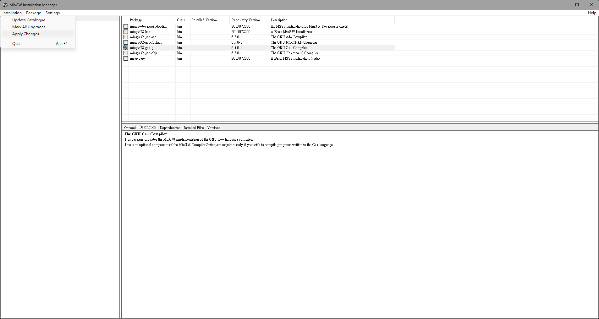
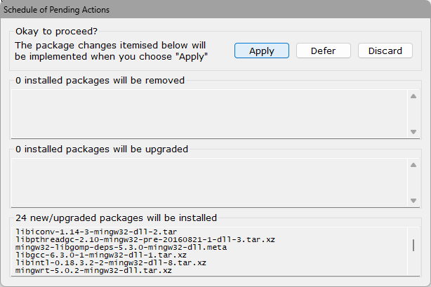
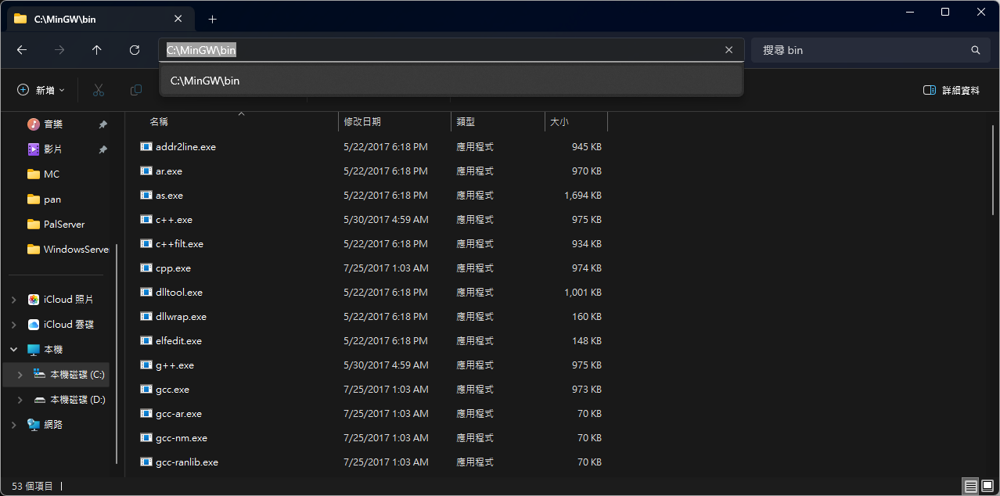

# 0. 環境架設
正所謂工欲善其事，必先利其器，此章我們分別會在分別講述如何在windows、macos上安裝相關套件。

我們預計要使用GNU C++ Compiler進行編譯，以及使用Visual studio code + clangd與``c++11``的標準撰寫程式，下面會詳述安裝流程。

當然，你也可以使用像是``dev c++``、``codeblock``這類的軟體進行撰寫，只不過有一點需要注意，舊版的``dev c++``預設沒有啟用c++11標準的支援，你必須要在設定裡面尋找開啟的方式。


## Windows
GNU C++ Compiler (G++)本身是沒有支援Windows的，但我們可以透過使用wsl2或者別人用好的移植版本進行使用，這邊我們會安裝別人寫好的移植版。
### 1.下載並安裝mingw
1. 前往[這個連結]()安裝mingw
2. 勾選 ``mingw32-gcc-g++``
   
3. ``installation`` > ``apply change``
   
4. 按下``apply``安裝
   
    


### 2. 加入環境變數
1. 尋找安裝位置，以我為例，是安裝在``C:\MinGW``裡面，找到裡面的``bin``資料夾，點進去並複製路徑。
    

### 3. 測試指令
開啟提示命令字元後，打入````


## macOS
macos本身就有提供clangd作為編譯器使用，在安裝xcode後應該就可以使用，如果還是需要GNU C++ Compiler，請參考下面步驟。

### 1.安裝homwbrew套件管理器
根據[官網](https://brew.sh)的指示安裝homebrew。

### 2.使用管理器安裝g++套件
1. 先使用``brew search gcc``搜尋相關套件
2. 使用 ``brew install gcc``安裝Compiler
3. 使用``gcc-13 -v``或``g++-13``確認是否成功安裝


[](https://asciinema.org/a/zuE3ZBuU06gkRhyllvhQ4zUwQ)

!!! Warning
    請注意，在macos上預設使用的``g++``指令為``clang``而不是``GNU C++ Compiler``，請改使用``g++-XX`` 來操作g++編譯器。


## Visual Studio Code
### 1. 安裝Visual Studio Code
前往[這個網站]()下載屬於你系統的visual studio code安裝檔。
### 2. 安裝 extension
1. 點入extension頁面分別安裝``C/C++`` ``clangd`` 這兩個extension，並重啟vscode
    <video autoplay muted loop controls><source src="../../cpp/media/vscode_ext.mp4" type="video/mp4"></video>
2. 你可能遇到這樣的警告訊息，請按下 ``Disable Intellisence``
   
### 其他
如果遇到字體非等寬，請尋找一個等寬字體並使用，等寬字體可以讓你的程式碼可讀性更佳。